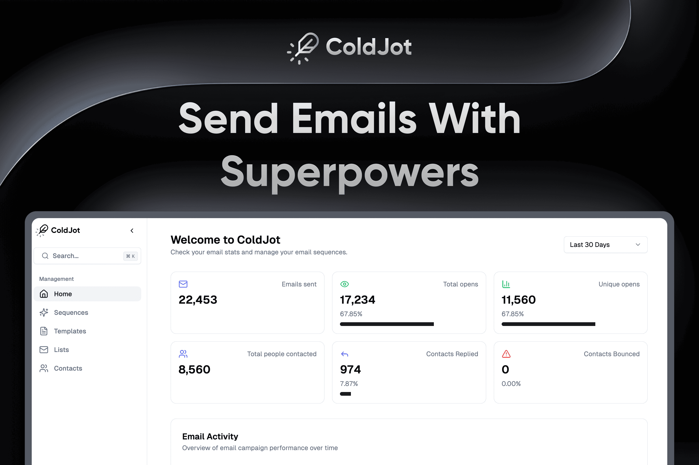

<h1 align="left">ColdJot</h3>
<a href="https://coldjot.com">
  
</a>

The modern email automation platform for managing and streamlining your email operations.

<!-- Feature Status Badges -->
<span id="badge-definitions">
  <code><span style="background-color: #FFECB3; color: #FF8F00; padding: 0.1em 0.2em; border-radius: 3px; font-size: 0.80em; font-weight: 600;">IN PROGRESS</span></code>
  <code><span style="background-color: #E3F2FD; color: #1976D2; padding: 0.1em 0.2em; border-radius: 3px; font-size: 0.80em; font-weight: 600;">COMING SOON</span></code>
</span>

> ### 📝 Development Guide
>
> <code><span style="background-color: #FFECB3; color: #FF8F00; padding: 0.1em 0.2em; border-radius: 3px; font-size: 0.80em; font-weight: 600;">IN PROGRESS</span></code>
>
> We're actively working on comprehensive development documentation. In the meantime, check the [docs](./docs/README.md) folder for setup guides and feature details. If you have any questions, feel free to [open an issue](https://github.com/dropocol/coldjot/issues) or join our community!

## What is ColdJot?

ColdJot is a powerful email automation platform designed to help businesses manage and streamline their email operations. With a focus on productivity and efficiency, ColdJot provides advanced email management capabilities, real-time processing, and a modern web interface.

## Features

- **Email Sequences** — Multi-step sequence automation with flexible timing, scheduling, and conditional logic for personalized follow-ups.
- **Analytics Dashboard** — Open and click tracking, response rate monitoring, and sequence performance metrics.
- **Contact Management** — Import, organize, and segment contacts with activity history tracking.
- **Email Templates** — Reusable rich-text templates with centralized editing that propagates everywhere.
- **Multiple Mailbox Support** — Connect unlimited accounts with centralized management and per-mailbox quotas.
- **Gmail Integration** — OAuth-based Gmail connectivity with reply tracking, quota management, and automatic rate limiting.
- **Timeline View** — Visualize your sequence timeline and monitor outgoing communications in real-time.
- **Security & Privacy** — Google OAuth authentication, privacy-focused design, and data protection measures.

> 📋 See the [full feature breakdown](./docs/features.md) for status badges and upcoming features.

## Screenshot


## Tech Stack

ColdJot is built with modern and reliable technologies:

- [Next.js](https://nextjs.org/) – framework
- [TypeScript](https://www.typescriptlang.org/) – language
- [Tailwind](https://tailwindcss.com/) – CSS
- [PostgreSQL](https://www.postgresql.org/) – database
- [Redis](https://redis.io/) – caching & queues
- [BullMQ](https://docs.bullmq.io/) – job processing
- [Auth.js](https://authjs.dev) – authentication
- [Turborepo](https://turbo.build/repo) – monorepo
- [Prisma](https://www.prisma.io/) – ORM

## Quick Start

```bash
# 1. Install dependencies
npm install

# 2. Start local services (PostgreSQL + Redis)
docker compose up -d

# 3. Copy env files and configure them
cp apps/web/env/.env.example apps/web/env/.env.development
cp apps/mailops/env/.env.example apps/mailops/env/.env.development
cp packages/database/env/.env.example packages/database/env/.env.development

# 4. Set up the database
cd packages/database && npm run db:generate && npm run db:migrate && cd ../..

# 5. Run the development server
npm run dev
```

Then open [http://localhost:3000](http://localhost:3000).

> ➡️ **For the full setup guide** (prerequisites, Google OAuth, env vars, optional Gmail reply notifications), see **[Getting Started](./docs/getting-started.md)**.

## Documentation

| Guide | Description |
| --- | --- |
| [Getting Started](./docs/getting-started.md) | Prerequisites, Docker, Google OAuth, env vars, database setup |
| [Features](./docs/features.md) | Full feature breakdown and development status |
| [Database](./docs/database.md) | Database commands across environments |
| [Environment Variables](./docs/env-setup-guide.md) | How env files load across the monorepo |
| [Gmail Reply Notifications](./docs/gmail-notifications-setup.md) | Optional PubSub setup for real-time replies |

## Contributing

We love our contributors! Here's how you can contribute:

- [Open an issue](https://github.com/dropocol/coldjot/issues) if you believe you've encountered a bug.
- Make a [pull request](https://github.com/dropocol/coldjot/pull) to add new features/make quality-of-life improvements/fix bugs.

### Issues

If you spot a problem with the docs, search if an issue already exists. If a related issue doesn't exist, you can open a new issue using a relevant issue form. To solve an existing issue, scan through our [issues](https://github.com/dropocol/coldjot/issues) and open a PR with a fix.

### Pull Request

When you're finished with your changes, create a pull request:

- Fill the "Ready for review" template so reviewers understand your changes.
- Link the PR to any issue it resolves.
- We may ask for changes before merging — apply suggested changes and mark conversations as resolved.

## License

ColdJot is open-source under the GNU Affero General Public License Version 3 (AGPLv3) or any later version. You can [find it here](https://github.com/dropocol/coldjot/blob/master/LICENSE).

---

🤍 **ColdJot – Email Automation, Reimagined.**
